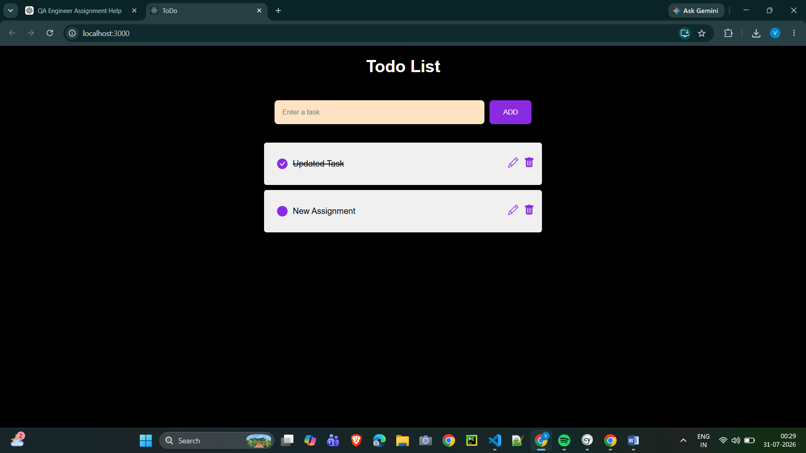
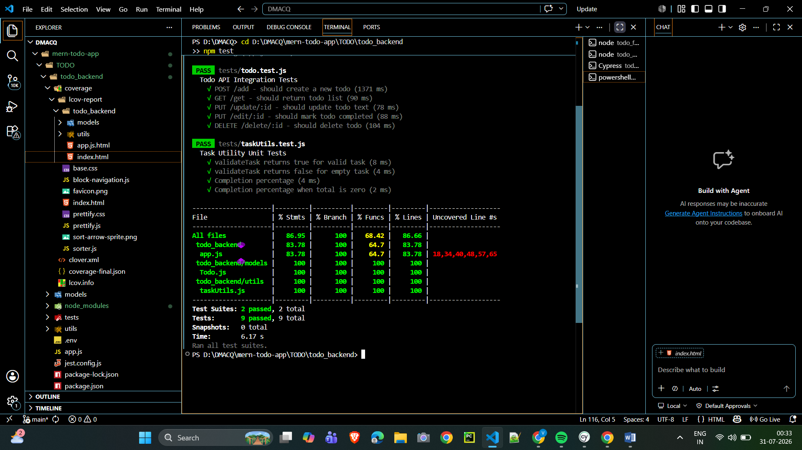
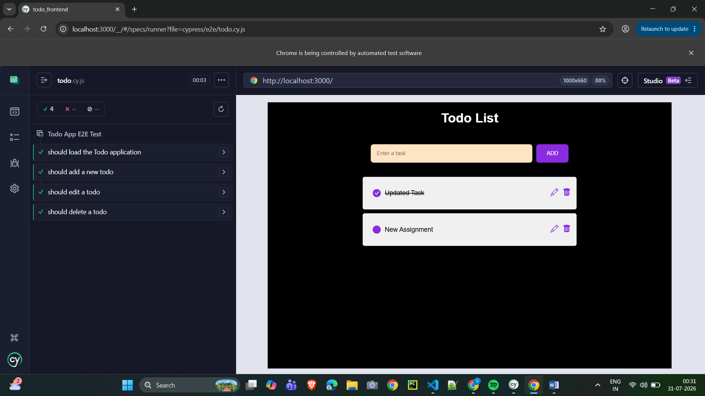

# 📝 MERN Todo Application with Automated Testing

A full-stack MERN Todo application developed as part of a QA Engineer Assignment.

This project demonstrates complete CRUD functionality along with Backend API Testing using Jest & Supertest and Frontend End-to-End Testing using Cypress.

---

# 🚀 Tech Stack

## Frontend

- React.js
- Axios
- React Icons
- CSS

## Backend

- Node.js
- Express.js
- MongoDB
- Mongoose

## Testing

- Jest
- Supertest
- Cypress

---

# 📂 Project Structure

```
TODO/
├── todo_backend
│   ├── tests
│   ├── utils
│   ├── app.js
│   ├── server.js
│   └── jest.config.js
│
├── todo_frontend
│   ├── cypress
│   ├── src
│   └── cypress.config.js
│
├── images
└── README.md
```

---

# ✨ Features

- Add Todo
- Update Todo
- Mark Todo Complete
- Delete Todo
- MongoDB Integration
- REST APIs
- Backend API Testing
- End-to-End UI Testing

---

# ⚙️ Installation

## Clone Repository

```bash
git clone https://github.com/gajbhiyevr09-star/mern-todo-app.git
```

## Install Dependencies

### Backend

```bash
cd TODO/todo_backend
npm install
npm start
```

Backend runs on:

```
http://localhost:5000
```

### Frontend

```bash
cd ../todo_frontend
npm install
npm start
```

Frontend runs on:

```
http://localhost:3000
```

---

# 🧪 Backend Testing

Run:

```bash
cd TODO/todo_backend
npm test
```

### Tested APIs

- POST /add
- GET /get
- PUT /update/:id
- PUT /edit/:id
- DELETE /delete/:id

---

# 🌐 Frontend Testing

Run:

```bash
cd TODO/todo_frontend
npx cypress open
```

Execute:

- Load Application
- Add Todo
- Edit Todo
- Delete Todo

---

# 📊 Code Coverage

| Metric | Coverage |
|---------|----------|
| Statements | **83.78%** |
| Branches | **100%** |
| Functions | **64.70%** |
| Lines | **83.78%** |

Coverage generated using **Jest + Istanbul**.

---

# 📸 Screenshots

## Application



## Backend Connected


## Frontend Running


## Jest Test Results



## Cypress Test Results



---

# 👨‍💻 Author

**Vaibhav Gajbhiye**

GitHub: https://github.com/gajbhiyevr09-star

---

# 📄 License

This project was developed for a QA Engineer Assessment.